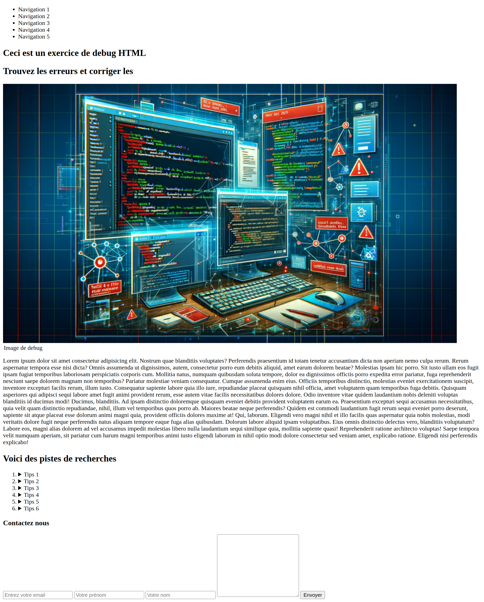

# Exercice pratique de recherche d'erreurs de code

Aide toi de l'inspecteur de code pour résoudre les problèmes HTML. Les fichiers sources peuvent aussi être utilisés.

Tu peux trouver le résultat final ici :

## Listes des erreurs

- src de l'image
- inversion des balises li et ul
- p à la place de summary
- croisement des balises sections
- il manque le texte alternatif
- page qui se charge en direct sur le formulaire
- longueur de texte pour le  prénom
- longueur de texte pour le nom
- action du formulaire
- largeur de la zone de texte
- pas d'indication de label pour les liseuses
- texte après la balise fermante details
- fermeture / ouverture des labels
